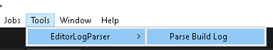
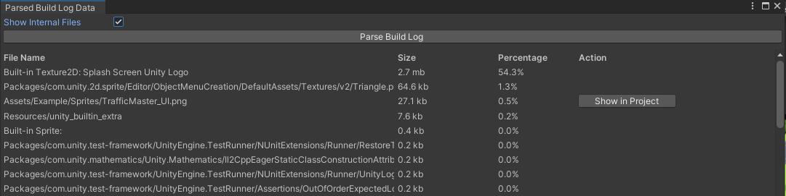

# EditorLogParser
Parser the EditorLog file and extract file size information from Build Report.

## Overview
- Outputs log from Build Report
- Added button for quick jump to a file

## Install
Download the zip or install via PM → Add package from git URL → `https://github.com/r-set/EditorLogParser.git?path=/Assets/EditorLogParser` → Add

## Usage

0. Assemble the build

1. In Unity, open Tools → EditorLogParser → Parse Build Log.

2. Click the button Parse Build Log.

